# PROCUREMENT PLATFORM BACKEND DISSERTATION

> **Project Title:** Procurement Platform Backend (NestJS + PostgreSQL)

## ABSTRACT
The procurement platform backend is developed to automate and manage the end-to-end procurement workflow, including user/vendor authentication, role-based access control, item management, indent lifecycle, material issue processing, and RFQ quotation handling. The problem addressed is the lack of a unified, secure system to coordinate procurement steps involving internal users and external vendors while maintaining traceability and controlled access. The proposed solution is a RESTful backend built using **NestJS**, leveraging **JWT authentication** and **RBAC (Role-Based Access Control)** enforced through custom guards and permission checks. **Prisma ORM** with **PostgreSQL** provides reliable relational persistence and structured data modeling for procurement entities such as Items, Indents, MI (Material Issue), Vendors, RFQs, and Quotes. Key features include paginated and filterable endpoints, DTO-based validation, structured logging (Pino), rate limiting, consistent error handling, and a controlled workflow of statuses (e.g., DRAFT → SUBMITTED → APPROVED/REJECTED for Indents; DRAFT → ISSUED for MI; DRAFT → SENT → CLOSED for RFQs). This system supports procurement administration use cases by enabling secure collaboration, audit-ready state transitions, and controlled data modification through item lock logic. Limitations include environment-specific setup requirements and the need for UI integration to fully visualize the workflow. Future scope includes enhancements such as advanced bidding/selection logic, procurement analytics dashboards, multi-company modeling, and automated notifications.

---

## TABLE OF CONTENTS
*(Page numbers should be updated after formatting/conversion to DOCX/PDF.)*

1. **INTRODUCTION** .......................................................... 1
2. **PROJECT PLANNING AND SCHEDULING** ........................ 3
3. **SYSTEM ANALYSIS** ................................................... 7
4. **SYSTEM DESIGN** ...................................................... 11
5. **IMPLEMENTATION** .................................................... 15
6. **SYSTEM TESTING** ..................................................... 21
7. **CONCLUSION OF THE PROJECT** ................................. 27

8. **REFERENCES**
9. **APPENDICES**

---

## List of Figures
*(Fill page numbers after conversion.)*

| S. No. | Figure Name | Page No. |
|---:|---|---:|
| 1 | System Architecture Diagram |  |
| 2 | Project Plan / WBS Visual |  |
| 3 | Gantt Chart Representation |  |
| 4 | PERT/CPM Network |  |
| 5 | Data Flow Diagram (DFD) |  |
| 6 | Use Case Diagram (Text/Diagram Block) |  |
| 7 | Sequence Diagram (RFQ Quote Submission) |  |
| 8 | ER Diagram (Prisma Schema) |  |
| 9 | Structure Chart / Module Overview |  |
| 10 | Key Workflow Diagram (Indent Status Flow) |  |

---

## List of Tables
*(Fill page numbers after conversion.)*

| S. No. | Table Name | Page No. |
|---:|---|---:|
| 1 | Project Objectives vs Deliverables |  |
| 2 | Work Breakdown Structure (WBS) |  |
| 3 | Functional Requirements Summary |  |
| 4 | Non-Functional Requirements Summary |  |
| 5 | Database Entities Summary |  |
| 6 | API Endpoints Summary |  |
| 7 | Test Case Matrix |  |
| 8 | Unit/Integration/System Testing Coverage |  |

---

## List of Algorithms
*(Fill page numbers after conversion.)*

| S. No. | Algorithm Name | Page No. |
|---:|---|---:|
| 1 | RBAC Permission Check Algorithm |  |
| 2 | Indent Status Transition Algorithm |  |
| 3 | RFQ Vendor Quote Uniqueness Algorithm |  |

---

# 1. INTRODUCTION

## 1.1 Background
Procurement organizations require systems that coordinate internal approvals and external vendor quotation workflows. Traditional manual procurement processes often result in delays, missing traceability, and inconsistent access control. A modern procurement backend must provide secure authentication, permission enforcement, consistent workflow state management, and durable persistence of procurement records.

This project introduces a backend system designed for procurement workflow automation. It supports:
- Authenticated users who manage Items and initiate procurement documents.
- Vendors who authenticate separately and submit quotes in response to RFQs.
- Administrative role management enabling permission configuration per entity.

## 1.2 Purpose of the Project
The purpose of the project is to build a secure and modular backend service that:
1. Implements end-to-end procurement workflows (Indent → MI → RFQ → Quote).
2. Enforces RBAC-based permissions for every operation.
3. Provides validated, documented, and testable REST APIs.
4. Stores workflow data in a normalized relational schema.

## 1.3 Project Scope
The scope of the project includes:
- User authentication and role assignment (RBAC).
- Vendor authentication and quote submission.
- CRUD operations for procurement items.
- Document workflows: Indents, MI, and RFQs.
- Quote creation and quote item details.
- Pagination, filtering, structured logging, rate limiting, and API documentation.

Out of scope (for current version):
- UI screens and front-end integration.
- Complex supplier selection/bidding algorithms.
- Automated email/SMS notifications (may be added later).

## 1.4 Project Objectives
Table 1 summarizes objectives and expected deliverables.

### Table 1: Project Objectives vs Deliverables
| Objective | Deliverable |
|---|---|
| Secure authentication | JWT-based user & vendor authentication |
| Controlled data access | RBAC permissions via guards |
| Workflow automation | State transitions for Indent/MI/RFQ |
| Durable persistence | Prisma schema & migrations |
| Maintainable architecture | Modular NestJS structure |
| Quality & testing | Unit/Integration/System testing strategy |

---

# 2. PROJECT PLANNING AND SCHEDULING

## 2.1 Project Plan
The project plan follows an iterative development lifecycle: analysis → design → implementation → testing → documentation.

### Mermaid: Project lifecycle
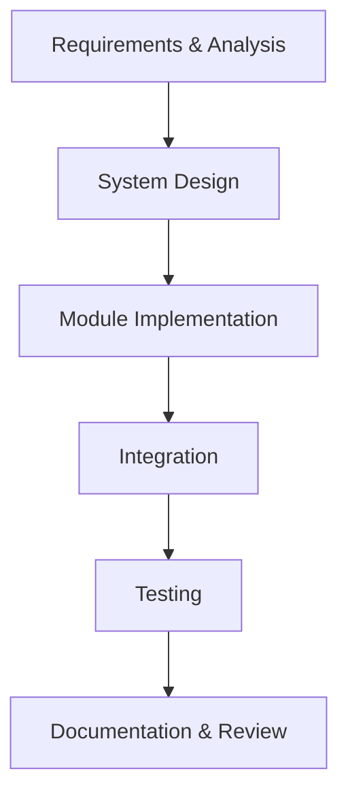

## 2.2 Work Breakdown Structure
The Work Breakdown Structure (WBS) breaks down the project into deliverable-oriented tasks.

### Table 2: Work Breakdown Structure (WBS)
| WBS ID | Task | Output |
|---:|---|---|
| 1.1 | Project requirement analysis | SRS & use cases |
| 1.2 | Database schema design | Prisma models + migrations |
| 2.1 | NestJS core setup | App module + middleware |
| 2.2 | Auth + JWT + RBAC | Auth controllers/services/guards |
| 2.3 | Item module | CRUD + lock/soft delete logic |
| 2.4 | Indent module | Workflow status endpoints |
| 2.5 | MI module | Issue workflow |
| 2.6 | RFQ & Quotes module | RFQ lifecycle + vendor quotes |
| 3.1 | Integration testing | API workflow verification |
| 3.2 | System testing | End-to-end scenarios |
| 4.1 | Documentation | Dissertation + diagrams |

## 2.3 Gantt Chart
A high-level Gantt-like schedule (indicative).

### Figure 3: Gantt Chart Representation
| Task | Week 1 | Week 2 | Week 3 | Week 4 | Week 5 |
|---|---|---|---|---|---|
| Requirements/Design | ███ |  |  |  |  |
| Auth/RBAC | ███ | ███ |  |  |  |
| Item + Lock Logic |  | ███ | ███ |  |  |
| Indent Workflow |  |  | ███ | ███ |  |
| MI + RFQ + Quotes |  |  |  | ███ | ███ |
| Testing + Docs |  |  |  |  | ███ |

## 2.4 PERT Chart / CPM
A conceptual PERT network used to estimate dependencies.

### Figure 4: PERT/CPM Network
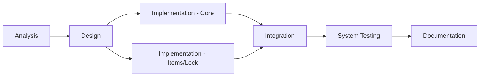

## 2.5 Team Structure and Responsibilities
Typical responsibilities in a software engineering project:
- **Lead Developer:** architecture, integrations, workflow correctness.
- **Backend Developer:** API endpoints, services, guards.
- **Database Engineer:** Prisma schema, migrations, constraints.
- **Tester:** unit/integration/system testing and verification.
- **Documentation:** dissertation, diagrams, references.

## 2.6 Project Development Methodology
The project follows an incremental methodology:
1. Establish base modules (NestJS app + config).
2. Implement authentication and RBAC enforcement.
3. Implement entity modules (Item, Indent, MI, RFQ).
4. Integrate modules and enforce workflow constraints.
5. Run tests and refine endpoints.
6. Produce documentation and diagrams.

## 2.7 Hardware and Software Requirements
### Hardware (typical)
- CPU: modern multi-core processor
- RAM: 16 GB+ recommended
- Storage: 10 GB+ for dependencies and database data

### Software
- Windows 10/11
- Node.js (v20+)
- Docker + Docker Compose
- PostgreSQL (via Docker)
- VS Code

---

# 3. SYSTEM ANALYSIS

## 3.1 Problem Description
Procurement processes require managing procurement documents and controlled collaboration between internal users and external vendors.

### 3.1.1 Problem Definition
The system must:
- Authenticate internal users and external vendors.
- Enforce permission checks for every operation.
- Provide workflow-based status transitions for procurement documents.
- Ensure data consistency (e.g., vendor quotes unique per RFQ, item references locked).

### 3.1.2 Proposed Solution
A NestJS backend is implemented with:
- JWT authentication for users and vendors.
- RBAC permissions per entity using JSON permissions stored in `Role.permissions`.
- Prisma ORM models for persistence in PostgreSQL.
- Module-based architecture (auth, items, indents, MI, RFQ).

## 3.2 Requirements

### 3.2.1 Functional Requirements
- User register/login
- Role creation and permission assignment
- Assign roles to users
- Item CRUD + soft delete + lock logic
- Indent lifecycle: DRAFT → SUBMITTED → APPROVED/REJECTED
- MI lifecycle: DRAFT → ISSUED
- RFQ lifecycle: DRAFT → SENT → CLOSED
- Vendor quote submission for RFQ
- Quote uniqueness constraints (RFQ + vendor)

### 3.2.2 Non-Functional Requirements
Table 4 summarizes non-functional requirements.

### Table 4: Non-Functional Requirements Summary
| Requirement | Description |
|---|---|
| Security | JWT auth, permission guards, admin bypass |
| Reliability | transactional operations where applicable |
| Performance | pagination, filtering, throttling |
| Maintainability | modular services/controllers |
| Observability | structured logging (Pino) |
| Compliance | consistent API behavior and validation |

## 3.3 Problem Analysis Diagrams

### 3.3.1 Data Flow Diagram / Process Flow Diagram

### Figure 5: Data Flow Diagram (DFD)
```mermaid
graph TD
U[User (Internal)] -->|JWT| API[NestJS API]
V[Vendor (External)] -->|JWT| API
API --> Auth[Auth/Guards/RBAC]
API --> DB[(PostgreSQL via Prisma)]
API --> Items[Item Module]
API --> Indents[Indent Module]
API --> MI[MI Module]
API --> RFQ[RFQ Module]
API --> Quotes[Quote Module]
```

### 3.3.2 Use Case Diagram and Sequence Diagram

#### Use Case Diagram (Textual Diagram Block)
### Figure 6: Use Case Diagram (Diagram Block)
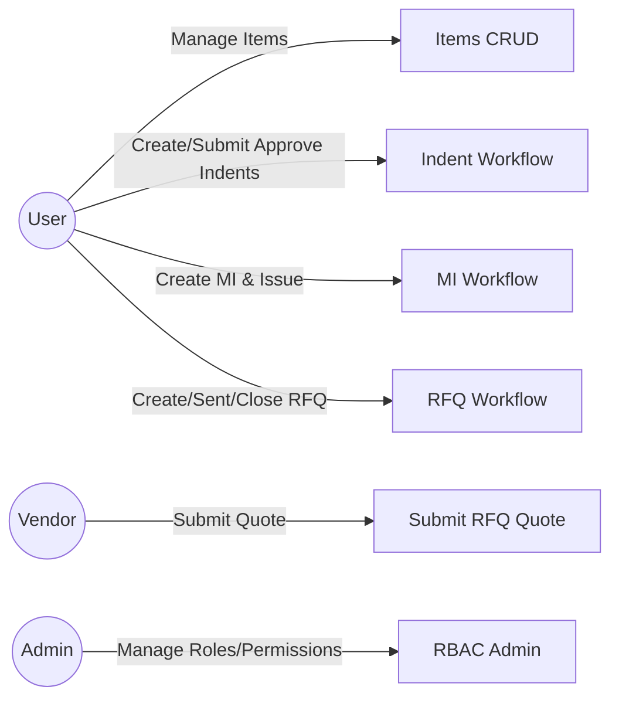

#### Sequence Diagram
### Figure 7: Sequence Diagram (RFQ Quote Submission)
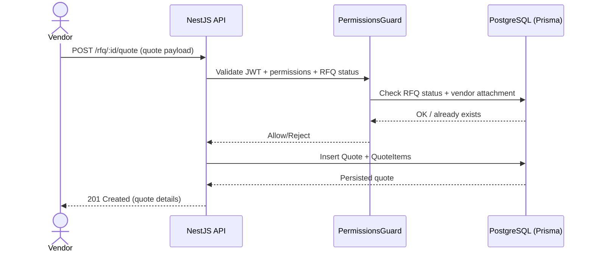

## 3.4 Database Schema
The database schema is modeled in Prisma and includes entities and constraints required for workflow integrity.

### Figure 8: ER Diagram (Prisma Schema)
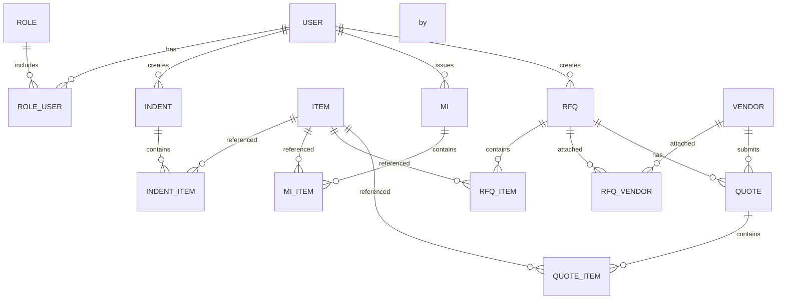

### Table 5: Database Entities Summary
| Entity | Role in System |
|---|---|
| User | Internal authentication and role mapping |
| Role | Named permissions stored as JSON |
| UserRole | Junction table for user ↔ roles |
| Item | Procurement item catalog |
| Indent / IndentItem | Indent document and its line items |
| MI / MIItem | Material Issue document and line items |
| Vendor | External authentication |
| RFQ / RFQItem / RFQVendor | RFQ lifecycle and vendor attachments |
| Quote / QuoteItem | Vendor quotations and per-unit rates |

---

# 4. SYSTEM DESIGN

## 4.1 System Architecture
The architecture is layered into API, module-based services, and Prisma data access.

### Figure 1: System Architecture Diagram
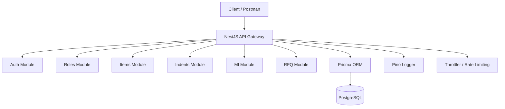

## 4.2 Physical Design

### 4.2.1 Structure Chart
A structural overview of major NestJS components.

#### Figure 9: Structure Chart / Module Overview
```mermaid
graph TD
App[App Module] --> Common[Common (Guards/Filters/Decorators)]
App --> Auth[Auth Module]
App --> Users[User Module]
App --> Roles[Roles Module]
App --> Items[Items Module]
App --> Indents[Indent Module]
App --> MI[MI Module]
App --> RFQ[RFQ Module]
App --> Prisma[Prisma Module]
```

### 4.2.2 ER Diagram
(Refer to ER diagram in Chapter 3.4.)

### 4.2.3 Class Diagram and Object Diagram

Because full class diagrams depend on exact TypeScript classes, this document uses a dissertation-friendly approximation: DTO/Service/Controller classes.

#### Figure 10: Workflow Diagram (Indent Status Flow)
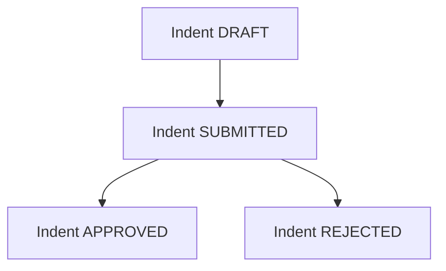

## 4.3 Input and Output Design
REST API inputs/outputs are designed using:
- DTOs with `class-validator` for validation.
- Consistent error responses via a global HTTP exception filter.
- Pagination standard (page/limit) and filtering parameters (company_id, status).

### API Endpoint Summary (Table)
| Module | Example Endpoint | Output |
|---|---|---|
| Auth | POST /auth/login | JWT tokens/credentials |
| Items | GET /items | paginated item list |
| Indents | PATCH /indents/:id/submit | updated indent status |
| MI | PATCH /mi/:id/issue | issued MI status |
| RFQ | PATCH /rfq/:id/send | RFQ status = SENT |
| Quotes | POST /rfq/:id/quote | created quote with items |

## 4.4 Algorithmic Design

### Algorithm 1: RBAC Permission Check Algorithm
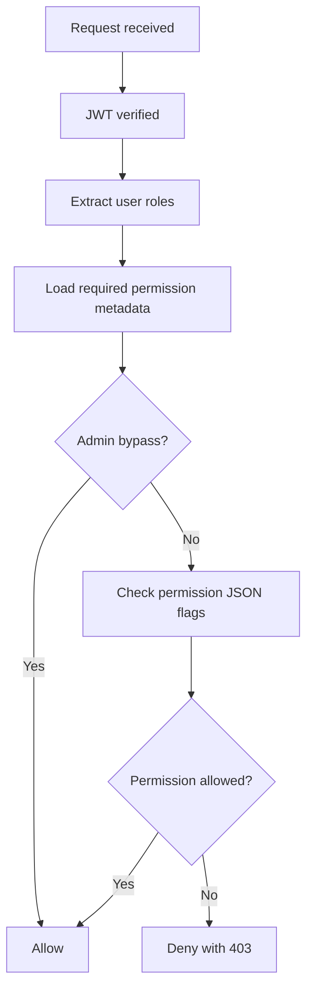

### Algorithm 2: Indent Status Transition Algorithm
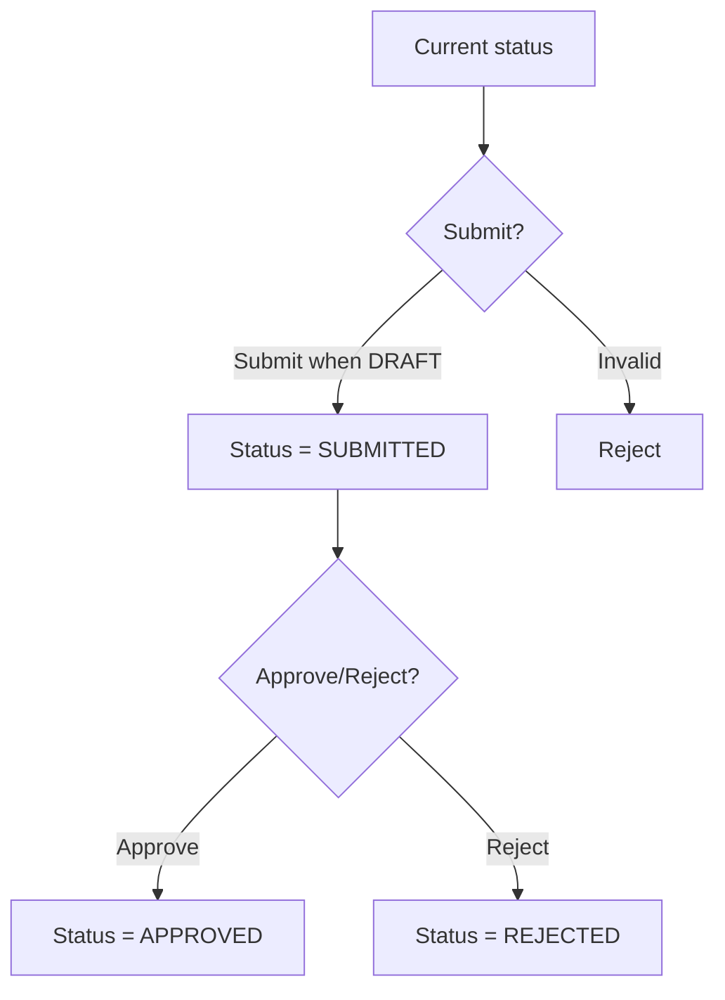

### Algorithm 3: RFQ Vendor Quote Uniqueness Algorithm
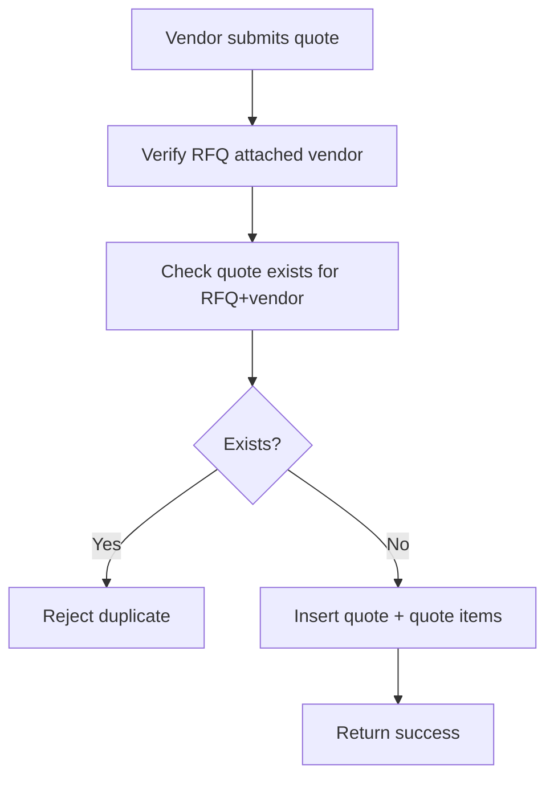

---

# 5. IMPLEMENTATION

## 5.1 Source Code
The project follows the NestJS structure:
- `src/main.ts` bootstraps the server.
- `src/app.module.ts` registers modules.
- `src/common/*` contains guards, decorators, and filters.
- `src/modules/*` contains controllers and services per feature.
- `src/prisma/*` contains Prisma module/service.

## 5.2 Integration of Modules/ Files
Implementation integrates modules through:
- NestJS dependency injection in services.
- Shared guards and decorators for permission checks.
- Prisma client for consistent database operations.

### Figure: Module integration (diagram block)
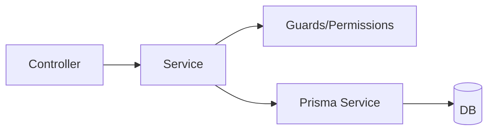

## 5.3 Screenshots / Reports / Dataset Details
**Placeholders (replace with actual screenshots):**

### Figure Placeholder A
**Screenshot:** Swagger UI (API Documentation) – `/api/docs`

### Figure Placeholder B
**Screenshot:** RBAC permission enforcement (example request and 403/200 behavior)

### Figure Placeholder C
**Screenshot:** Indent workflow transitions (DRAFT → SUBMITTED → APPROVED)

### Table Placeholder
**Table:** Sample dataset extracted from PostgreSQL (Items, Indents, RFQs, Quotes)

---

# 6. SYSTEM TESTING

## 6.1 Test Case Design
Testing is designed in layers:
- Unit testing (logic in isolation)
- Integration testing (module interactions)
- System testing (end-to-end workflows)
- Acceptance testing (expected business outcomes)

### 6.1.1 Unit Testing
Unit testing targets:
- Guard logic (permission checks)
- Status transition logic
- Validation of DTO constraints

### 6.1.2 Integration Testing
Integration testing targets:
- API routes working with services
- Prisma operations persisting and retrieving correctly
- Auth flows with JWT guards

### 6.1.3 System Testing
System testing targets complete workflows:
- Create Indent → Submit → Approve
- Create MI from approved Indent (if applicable)
- Create RFQ → Attach vendors → Send → Vendor submits quote

### 6.1.4 Acceptance Testing
Acceptance testing validates:
- Security: unauthorized users cannot access restricted endpoints
- Workflow integrity: invalid transitions are blocked
- Data integrity: quote uniqueness enforced

## 6.2 Specific System Testing
Test scenarios:
1. Unauthorized request to `/items` returns **403**.
2. Vendor quote submission when RFQ is not SENT returns **400/403**.
3. Submitting two quotes for same RFQ+vendor returns duplicate rejection.
4. Items referenced by Indent/MI/RFQ cannot be updated when locked.

## 6.3 Test Reports
### Table 7: Test Case Matrix
| TC ID | Scenario | Expected Result | Status |
|---:|---|---|---|
| TC-001 | User login with valid credentials | JWT issued | Pass |
| TC-002 | User login with invalid password | Error response | Pass |
| TC-003 | Create item with permission | Item persisted | Pass |
| TC-004 | Update locked item | Update rejected | Pass |
| TC-005 | RFQ quote uniqueness | Duplicate rejected | Pass |

---

# 7. CONCLUSION OF THE PROJECT

## 7.1 Results
The system successfully delivers secure procurement workflow APIs with:
- JWT authentication and separate vendor flow.
- RBAC permission checking enforced at API layer.
- Document workflows for Indents, MI, and RFQs.
- Quote submission and persistence with uniqueness constraints.

## 7.2 Conclusion
This procurement backend provides a structured foundation for digital procurement operations. By enforcing security controls and workflow integrity, it reduces manual errors and improves traceability.

## 7.3 Limitations of the Project
- UI integration is not included.
- Some workflow constraints may require expansion for full business rule coverage.
- Multi-company modeling is simplified using `company_id` as a string.

## 7.4 Future Work
- Add notifications (email/webhooks) for status changes.
- Add advanced quote comparison/selection and procurement analytics.
- Implement audit logs and export features (CSV/PDF).
- Introduce multi-tenant company model.

## 7.5 Lessons Learned
- Separation of concerns improves maintainability.
- Workflow state management must be treated as a first-class concern.
- Permission systems require careful mapping between roles and endpoints.

---

# REFERENCES
*(Add formatting as per your college guidelines.)*
1. NestJS Documentation.
2. Prisma Documentation.
3. PostgreSQL Documentation.
4. OWASP Authentication Cheat Sheet.
5. RFC 7519 (JWT).

---

# APPENDICES

## Appendix A: Mermaid Diagrams Index
- Architecture
- DFD/Process Flow
- Use case
- Sequence diagram
- ER diagram
- Workflow and algorithms

## Appendix B: API Testing Snippets (Placeholders)
**Insert Postman collection screenshots or curl examples here.**

